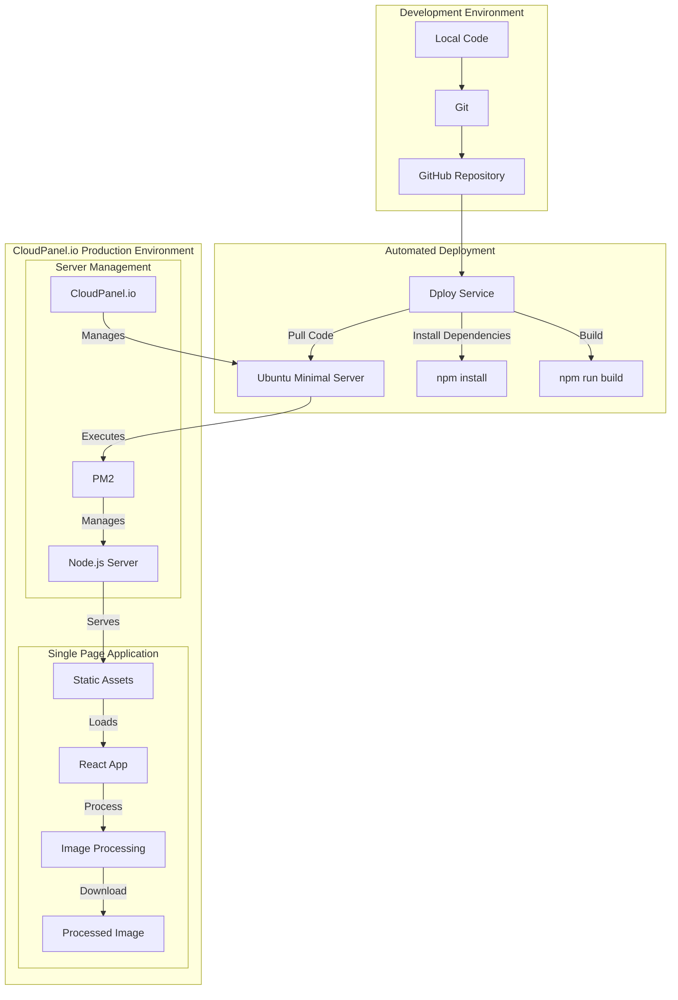

# WEB-CopiaDNI

https://copiadni.com/

A secure web application for processing identity documents with a privacy-first approach, built with Node.js and hosted on CloudPanel.io. This application allows users to process identity document images securely by converting them to black and white and adding customizable watermarks. All processing occurs locally in the user's browser, ensuring maximum privacy and security.

*Read this in: [English](README.md), [Spanish](README_ES.md)*

## Infrastructure & Technology Stack

At its core, this web application is built primarily with JavaScript, leveraging modern web development technologies. The application uses JavaScript both for the user interface (frontend) and the server (backend), which is made possible through Node.js. This unified approach to development, using a single programming language throughout the entire application, significantly streamlines development and maintenance. **In the frontend**, React serves as the main framework for building the user interface, providing a smooth and responsive experience. This is complemented by Tailwind CSS, which provides ready-to-use styles and designs. **On the backend**, Node.js acts as the bridge that allows JavaScript to run on the server side. Node.js enables us to use JavaScript throughout the entire application. Express.js, building on top of Node.js, simplifies common server tasks like serving files to browsers. **The application** is hosted on a cloud infrastructure managed through CloudPanel.io, running on an Ubuntu Minimal instance. This setup provides a robust and efficient environment for running Node.js applications, with PM2 ensuring continuous operation by managing and automatically restarting the application if needed.

### Why Node.js?

Node.js was chosen as the foundation for this web application for these reasons:

- **JavaScript Ecosystem**: Node.js allows using JavaScript both on the client and server side, providing a unified language throughout the application stack. This enables seamless development and maintenance.
- **Performance**: Node.js's event-driven, non-blocking I/O model makes it particularly efficient for serving web applications, especially those handling concurrent connections.
- **Rich Package Ecosystem**: Access to npm (Node Package Manager) provides a vast library of open-source packages and tools that accelerate development.
- **Modern Development**: Integration with current development tools and practices, including React for frontend development and Express.js for backend services.

The complete technology stack includes:

### Frontend Development
- **React 18**: A JavaScript library for building user interfaces
- **Vite**: A modern frontend build tool that offers faster development experience
- **Tailwind CSS**: A utility-first CSS framework for rapid UI development

### Backend & Server
- **Node.js**: Runtime environment for executing JavaScript server-side
- **Express.js**: Web application framework for serving static files
- **PM2**: Process manager for Node.js applications in production

## Key Features

The application provides a straightforward and secure way to process identity documents:

- Complete browser-based image processing with no server storage
- Black and white image conversion
- Customizable watermark system with adjustable text, colors, and opacity
- Single-page application with intuitive modal interfaces
- Privacy-focused architecture
- Responsive design for all devices

## Project Structure

```
.
├── src/
│   ├── components/
│   │   ├── image/
│   │   │   ├── CameraCapture.jsx
│   │   │   ├── ImagePreview.jsx
│   │   │   └── ImageUploader.jsx
│   │   ├── layout/
│   │   │   ├── Header.jsx
│   │   │   └── Body.jsx
│   │   └── ui/
│   │       ├── ActionButtons.jsx
│   │       ├── WatermarkControls.jsx
│   │       ├── InstructionsModal.jsx
│   │       └── LegalNotice.jsx
│   ├── utils/
│   │   └── imageProcessing.js
│   ├── assets/
│   │   └── react.svg
│   ├── App.jsx
│   ├── App.css
│   ├── main.jsx
│   └── index.css
├── public/
│   ├── vite.svg
│   └── ejemplo-procesado.jpg
├── server.js
├── vite.config.js
├── tailwind.config.js
├── postcss.config.js
├── eslint.config.js
├── package.json
└── package-lock.json
```

## Development Architecture



## How It Works

The application follows a secure, client-side processing workflow:

1. **Document Upload**: Users can upload document images through their browser
2. **Local Processing**: Images are processed entirely in the client's browser:
   - Conversion to black and white
   - Application of custom watermark
   - No data transmission to external servers
3. **Download**: Processed images are immediately available for download
4. **Privacy**: No images or data are stored or transmitted

## Privacy & Security

The application prioritizes user privacy and security through:

- Client-side processing of all images
- No server-side storage of documents
- SSL/TLS encryption for all connections
- Regular security updates and maintenance

## License

This project is licensed under the GNU AGPLv3 License. This means:

- You can view and fork this repository
- You must maintain the same license for any modifications
- You must disclose the source code of any modifications
- Commercial use requires explicit permission

See the [LICENSE](LICENSE) file for details.
