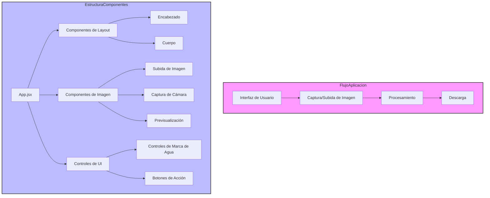
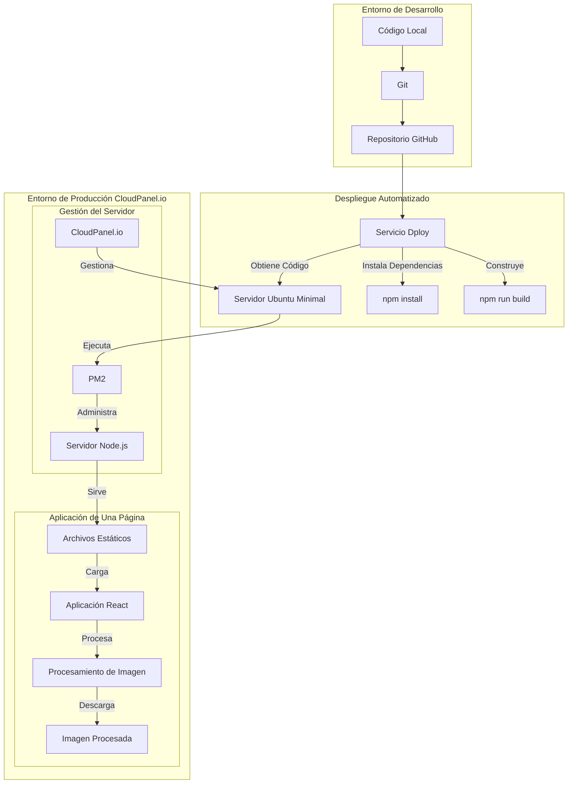

# WEB-CopiaDNI

*Leer en: [Inglés](README.md), [Español](README_ES.md)*

**CopiaDNI** es una aplicación web para el procesamiento de documentos de identidad con un enfoque centrado en la privacidad, desarrollada con Node.js y alojada en una maquina virtual Ubuntu minimal con CloudPanel.io. Esta aplicación permite a los usuarios procesar imágenes de documentos de identidad de manera segura, convirtiéndolas a blanco y negro y añadiendo marcas de agua personalizables. Todo el procesamiento ocurre localmente en el navegador del usuario, garantizando la máxima privacidad y seguridad.

https://copiadni.es/ 

https://copiadni.com/

## Infraestructura y Stack Tecnológico

La web está construida con JavaScript. La aplicación utiliza JavaScript tanto para la interfaz de usuario (frontend) como para el servidor (backend), lo cual es posible gracias a Node.js. Este enfoque unificado de desarrollo, utilizando un único lenguaje de programación en toda la aplicación, simplifica significativamente el desarrollo y mantenimiento. **En el frontend**, React sirve como el framework principal para construir la interfaz de usuario, proporcionando una experiencia fluida y responsive. Esto se complementa con Tailwind CSS, que proporciona estilos y diseños listos para usar. **En el backend**, Node.js actúa como el puente que permite que JavaScript se ejecute en el lado del servidor. Node.js nos permite utilizar JavaScript en toda la aplicación. Express.js, construido sobre Node.js, simplifica tareas comunes del servidor como servir archivos a los navegadores. **La aplicación** está alojada en una máquina virtual (instancia cloud) que ejecuta Ubuntu Minimal como sistema operativo. La aplicación Node.js se ejecuta y gestiona mediante PM2, un gestor de procesos que asegura su funcionamiento continuo y proporciona capacidades de reinicio automático. CloudPanel.io se utiliza como panel de control web para facilitar la administración del servidor.

### ¿Por qué Node.js?

Uso Node.js como base para esta aplicación web por la siguientes razones:

- **Ecosistema JavaScript**: Node.js permite utilizar JavaScript tanto en el cliente como en el servidor, proporcionando un lenguaje unificado en toda la pila de aplicaciones. Esto facilita el desarrollo y mantenimiento.
- **Rendimiento**: El modelo de E/S no bloqueante y dirigido por eventos de Node.js lo hace particularmente eficiente para servir aplicaciones web, especialmente aquellas que manejan conexiones concurrentes.
- **Ecosistema Rico de Paquetes**: El acceso a npm (Node Package Manager) proporciona una amplia biblioteca de paquetes y herramientas de código abierto que aceleran el desarrollo.
- **Desarrollo Moderno**: Integración con herramientas y prácticas de desarrollo actuales, incluyendo React para desarrollo frontend y Express.js para servicios backend.

El stack tecnológico completo incluye:

### Desarrollo Frontend
- **React 18**: Biblioteca de JavaScript para construir interfaces de usuario
- **Vite**: Herramienta de construcción frontend moderna que ofrece una experiencia de desarrollo más rápida
- **Tailwind CSS**: Framework CSS basado en utilidades para desarrollo rápido de interfaces

### Backend y Servidor
- **Node.js**: Entorno de ejecución para ejecutar JavaScript del lado del servidor
- **Express.js**: Framework de aplicaciones web para servir archivos estáticos
- **PM2**: Gestor de procesos para aplicaciones Node.js en producción

## Características Principales

La aplicación proporciona una forma sencilla y segura de procesar documentos de identidad:

- Procesamiento de imágenes completamente en el navegador sin almacenamiento en servidor
- Conversión de imágenes a blanco y negro
- Sistema de marca de agua personalizable con texto, colores y opacidad ajustables
- Aplicación de una sola página con interfaces modales intuitivas
- Arquitectura centrada en la privacidad
- Diseño responsivo para todos los dispositivos

## Estructura del Proyecto

```
.
├── src/                                # Directorio de código fuente con todos los componentes
│   ├── components/                     # Componentes React organizados por funcionalidad
│   │   ├── image/                      # Componentes de manejo de imágenes
│   │   │   ├── CameraCapture.jsx       # Gestiona el acceso a la cámara y captura de fotos
│   │   │   ├── ImagePreview.jsx        # Muestra las imágenes original y procesada
│   │   │   └── ImageUploader.jsx       # Maneja la selección y subida de imágenes
│   │   ├── layout/                     # Componentes estructurales
│   │   │   ├── Header.jsx              # Encabezado con título y descripción
│   │   │   └── Body.jsx                # Componente contenedor principal
│   │   └── ui/                         # Componentes de interfaz de usuario
│   │       ├── ActionButtons.jsx       # Botones de procesar, descargar y cancelar
│   │       ├── WatermarkControls.jsx   # Controles de texto, color y opacidad de marca de agua
│   │       ├── InstructionsModal.jsx   # Diálogo modal con instrucciones de uso
│   │       └── LegalNotice.jsx         # Componente de información legal y privacidad
│   ├── utils/                          # Funciones de utilidad y ayuda
│   │   └── imageProcessing.js          # Lógica principal de procesamiento y marca de agua
│   ├── assets/                         # Directorio de recursos estáticos
│   │   └── react.svg                   # Logo de React
│   ├── App.jsx                         # Componente principal y gestión de estado
│   ├── App.css                         # Estilos específicos de la aplicación
│   ├── main.jsx                        # Punto de entrada de la aplicación
│   └── index.css                       # Estilos CSS globales
├── public/                             # Directorio de recursos públicos
│   ├── vite.svg                        # Logo de Vite
│   └── ejemplo-procesado.jpg           # Imagen de ejemplo de documento procesado
├── server.js                           # Configuración y configuración del servidor Node.js
├── vite.config.js                      # Configuración de la herramienta de construcción Vite
├── tailwind.config.js                  # Configuración del framework Tailwind CSS
├── postcss.config.js                   # Configuración de procesamiento PostCSS
├── eslint.config.js                    # Configuración de calidad de código ESLint
└── package.json                        # Dependencias y scripts del proyecto
```

## Descripción de la Arquitectura 

Para mostrar una mejor comprensión de la arquitectura de la aplicación, este repositorio incluye un archivo [core.js](core.js) que demuestra la estructura y el flujo de la aplicación. Este archivo tipo skeleton sirve como documentación técnica que ilustra cómo interactúan los diferentes componentes.

`core.js` refleja la implementación real los componentes del proyecto y muestra cómo la aplicación administra el procesamiento de imágenes, las interacciones de la interfaz de usuario y las medidas de seguridad. Proporciona información sobre la administración de estados, la jerarquía de componentes y el flujo de procesamiento sin exponer detalles confidenciales de la implementación.



## Arquitectura de Desarrollo



## Funcionamiento

La aplicación sigue un flujo de trabajo seguro con procesamiento del lado del cliente:

1. **Subida de Documentos**: Los usuarios pueden subir imágenes de documentos a través de su navegador
2. **Procesamiento Local**: Las imágenes se procesan enteramente en el navegador del cliente:
   - Conversión a blanco y negro
   - Aplicación de marca de agua personalizada
   - Sin transmisión de datos a servidores externos
3. **Descarga**: Las imágenes procesadas están disponibles inmediatamente para su descarga
4. **Privacidad**: No se almacenan ni transmiten imágenes o datos

## Privacidad y Seguridad

La aplicación prioriza la privacidad y seguridad del usuario mediante:

- Procesamiento de todas las imágenes en el lado del cliente
- Sin almacenamiento de documentos en el servidor
- Cifrado SSL/TLS para todas las conexiones
- Actualizaciones y mantenimiento regular de seguridad

## Licencia

Este proyecto está licenciado bajo la Licencia GNU AGPLv3. Esto significa:

- Puedes ver y hacer fork de este repositorio
- Debes mantener la misma licencia para cualquier modificación
- Debes revelar el código fuente de cualquier modificación
- El uso comercial requiere permiso explícito

Ver el archivo [LICENSE](LICENSE) para más detalles.
