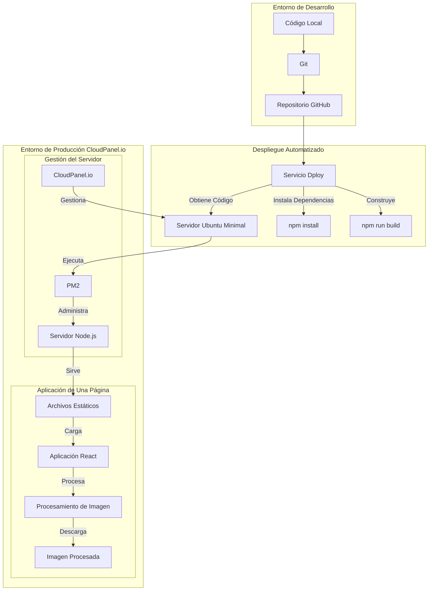

# WEB-CopiaDNI

Una aplicación web segura para el procesamiento de documentos de identidad con un enfoque centrado en la privacidad, desarrollada con Node.js y alojada en [CloudPanel.io](https://www.cloudpanel.io). Esta aplicación permite a los usuarios procesar imágenes de documentos de identidad de manera segura, convirtiéndolas a blanco y negro y añadiendo marcas de agua personalizables. Todo el procesamiento ocurre localmente en el navegador del usuario, garantizando la máxima privacidad y seguridad.

*Leer en: [Inglés](README.md), [Español](README_ES.md)*

## Infraestructura y Stack Tecnológico

La aplicación está alojada en una instancia cloud con SO Ubuntu Minimal gestionada a través de CloudPanel.io, un panel de control de servidor que ofrece soporte para aplicaciones Node.js. CloudPanel.io proporciona un entorno optimizado para implementaciones Node.js, ofreciendo gestión automatizada de certificados SSL, administración de procesos y capacidades de despliegue automatizadas.

### ¿Por qué Node.js?

Uso Node.js como base para esta aplicación web por la siguientes razones:

- **Ecosistema JavaScript**: Node.js permite utilizar JavaScript tanto en el cliente como en el servidor, proporcionando un lenguaje unificado en toda la pila de aplicaciones. Esto facilita el desarrollo y mantenimiento.
- **Rendimiento**: El modelo de E/S no bloqueante y dirigido por eventos de Node.js lo hace particularmente eficiente para servir aplicaciones web, especialmente aquellas que manejan conexiones concurrentes.
- **Ecosistema Rico de Paquetes**: El acceso a npm (Node Package Manager) proporciona una amplia biblioteca de paquetes y herramientas de código abierto que aceleran el desarrollo.
- **Desarrollo Moderno**: Integración con herramientas y prácticas de desarrollo actuales, incluyendo React para desarrollo frontend y Express.js para servicios backend.

El stack tecnológico completo incluye:

### Desarrollo Frontend
- **React 18**: Biblioteca de JavaScript para construir interfaces de usuario
- **Vite**: Herramienta de construcción frontend moderna que ofrece una experiencia de desarrollo más rápida
- **Tailwind CSS**: Framework CSS basado en utilidades para desarrollo rápido de interfaces

### Backend y Servidor
- **Node.js**: Entorno de ejecución para ejecutar JavaScript del lado del servidor
- **Express.js**: Framework de aplicaciones web para servir archivos estáticos
- **PM2**: Gestor de procesos para aplicaciones Node.js en producción

## Características Principales

La aplicación proporciona una forma sencilla y segura de procesar documentos de identidad:

- Procesamiento de imágenes completamente en el navegador sin almacenamiento en servidor
- Conversión de imágenes a blanco y negro
- Sistema de marca de agua personalizable con texto, colores y opacidad ajustables
- Aplicación de una sola página con interfaces modales intuitivas
- Arquitectura centrada en la privacidad
- Diseño responsivo para todos los dispositivos

## Estructura del Proyecto

```
.
├── src/
│   ├── components/
│   │   ├── image/
│   │   │   ├── CameraCapture.jsx
│   │   │   ├── ImagePreview.jsx
│   │   │   └── ImageUploader.jsx
│   │   ├── layout/
│   │   │   ├── Header.jsx
│   │   │   └── Body.jsx
│   │   └── ui/
│   │       ├── ActionButtons.jsx
│   │       ├── WatermarkControls.jsx
│   │       ├── InstructionsModal.jsx
│   │       └── LegalNotice.jsx
│   ├── utils/
│   │   └── imageProcessing.js
│   ├── assets/
│   │   └── react.svg
│   ├── App.jsx
│   ├── App.css
│   ├── main.jsx
│   └── index.css
├── public/
│   ├── vite.svg
│   └── ejemplo-procesado.jpg
├── server.js
├── vite.config.js
├── tailwind.config.js
├── postcss.config.js
├── eslint.config.js
├── package.json
└── package-lock.json
```

## Arquitectura de Desarrollo



## Funcionamiento

La aplicación sigue un flujo de trabajo seguro con procesamiento del lado del cliente:

1. **Subida de Documentos**: Los usuarios pueden subir imágenes de documentos a través de su navegador
2. **Procesamiento Local**: Las imágenes se procesan enteramente en el navegador del cliente:
   - Conversión a blanco y negro
   - Aplicación de marca de agua personalizada
   - Sin transmisión de datos a servidores externos
3. **Descarga**: Las imágenes procesadas están disponibles inmediatamente para su descarga
4. **Privacidad**: No se almacenan ni transmiten imágenes o datos

## Privacidad y Seguridad

La aplicación prioriza la privacidad y seguridad del usuario mediante:

- Procesamiento de todas las imágenes en el lado del cliente
- Sin almacenamiento de documentos en el servidor
- Cifrado SSL/TLS para todas las conexiones
- Actualizaciones y mantenimiento regular de seguridad

## Licencia

Este proyecto está licenciado bajo la Licencia GNU AGPLv3. Esto significa:

- Puedes ver y hacer fork de este repositorio
- Debes mantener la misma licencia para cualquier modificación
- Debes revelar el código fuente de cualquier modificación
- El uso comercial requiere permiso explícito

Ver el archivo [LICENSE](LICENSE) para más detalles.
